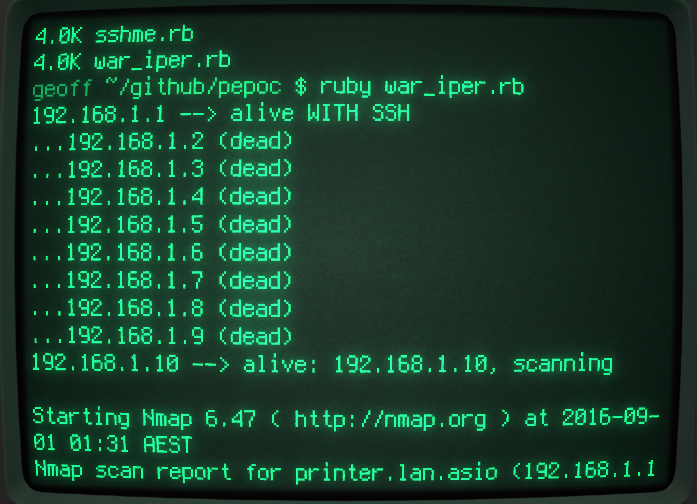

# war_ip

## What's this?
Sequentially tests connectivity to each sequential IP address just like an old-skool war dialer

## What the hell do you want to do that for?
Just for my own amusement.  Might possibly make a cool way of detecting network hosts to install puppet on...

## What does it look like?

Works best in [cool-retro-term](https://github.com/Swordfish90/cool-retro-term) :)

